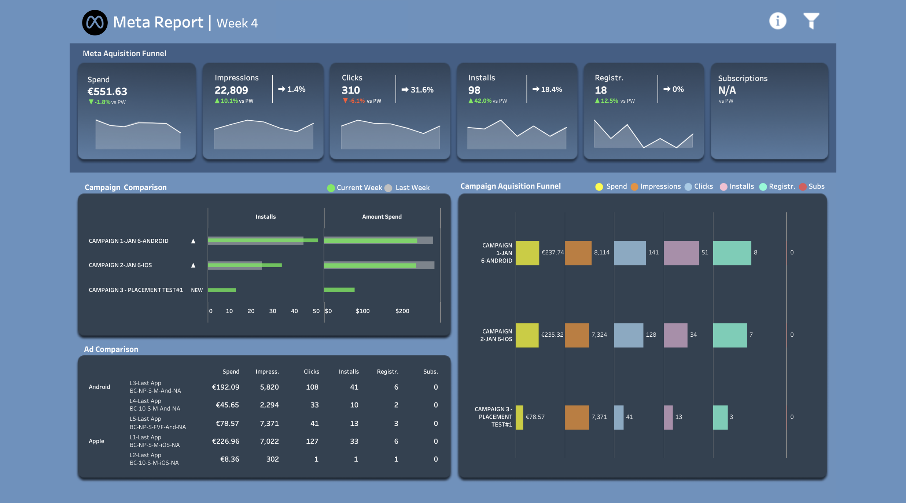
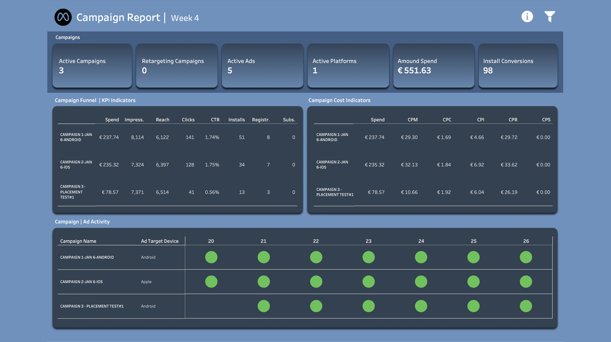

# Meta Ads Growth Analytics Case Study (Marketplace) — Week 4

## Executive Summary
I analyzed Meta Ads performance (creative + audience + placement) and the acquisition funnel (ad view → click → install → registration → onboarding completion) to guide weekly budget and optimization decisions.

**Week 4 highlights (WoW):**
- CPM decreased ~10% after a prior spike; expected variance due to placement mix and optimization behavior.
- CPC increased ~5% WoW, while **CPI improved ~31% to €5.63** (best YTD).
- Funnel improvements were partially offset by weaker onboarding completion; still **CPR improved ~13% to €30.65**.
- Placement test (Campaign 3) delivered **low CPM (€10.66)** with **CPI €6.04** and **CPR €26.19** (early days / small numbers).

> Note: Some underlying data is not shareable; visuals are provided via screenshots/exports.

---

## Context & Goal (Decision-Making)
**Business objective:** Acquire users likely to convert into paying subscribers.  
**Decision question:** Which creatives / placements / audiences should we scale, and what should we change next week?

## Data (High level)
- Meta Ads reporting: CPM, CPC, CPI, CPR; breakdowns by placement and audience segments.
- Acquisition + onboarding funnel snapshot (exported from internal tracking).

## Approach (How I analyzed)
1) Weekly performance review of cost metrics (CPM/CPC/CPI/CPR) and trend context.
2) Creative & placement evaluation (identify early “winners” and underfunded segments).
3) Funnel analysis to locate conversion bottlenecks after install/registration.

### Optimization principle used
Meta’s algorithm learns from conversion signals. Optimizing too high in the funnel (e.g., clicks/installs) can buy cheap but low-intent users; optimizing toward meaningful signals aligns spend with business outcomes. Stability improves with sufficient weekly conversion events and avoiding frequent “significant edits” that reset learning.

## Key Findings

### 1) Install + registration efficiency improved
- CPI reached **€5.63** (best YTD), indicating improved install efficiency.
- CPR improved to **€30.65**, despite onboarding weakness.

### 2) Placement test showed promising early efficiency
- Campaign 3 (placement test) early signal:
  - CPM €10.66
  - CPI €6.04
  - CPR €26.19
- Interpreted as directional; requires more volume for confidence.

### 3) Onboarding became the bottleneck

- Funnel performance weakened: only **~39%** completed onboarding in the referenced period.
- Biggest losses were in specific onboarding steps.

## Recommendations (What I would do next week)
- Keep optimizing toward meaningful conversion signals (avoid “cheap” upper-funnel-only optimization).
- Continue/scale the placement test cautiously while monitoring stability for 1–2 more weeks.
- Prioritize onboarding fixes on the highest drop-off steps before scaling spend further.

## Artifacts
- `Marketing Report W4 2025.pdf` (export)
- `Onboarding funnel Week 5.pdf` (export)
- `Meta Ads Ultimate Guide.docx` (optimization notes / methodology)

## Limitations
- Some data and dashboards cannot be shared publicly.
- Small sample periods can cause volatility; interpretation emphasizes directionality + decision framework.

## Next steps (v2)
- Add audience breakdown (segment performance) + budget allocation table.
- Add a “Decision log”: what was changed, why, and expected impact.
